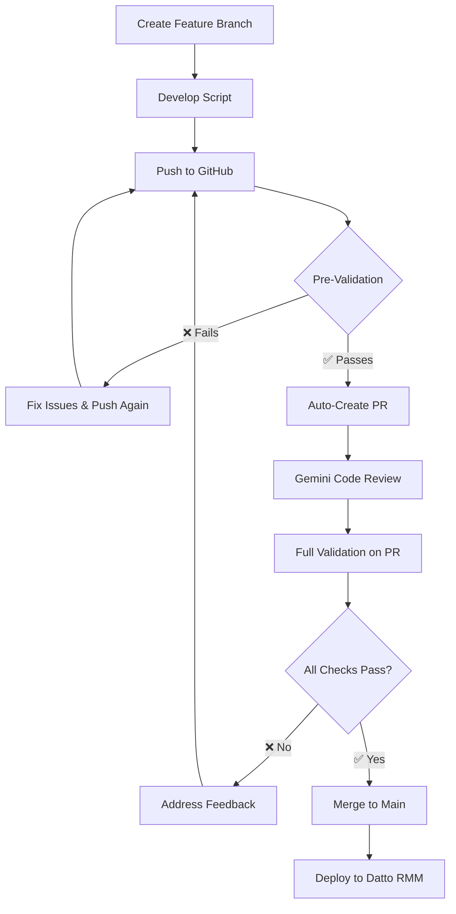

# 🚀 Developer Workflow Guide - Never F*ck Up Again

## 🎯 **The Bulletproof Development Process**

This guide ensures **zero production issues** by combining validation, automation, and AI code review.

## 📋 **Quick Start: The Safe Way to Develop**

### **1. 🌿 Create Feature Branch**

```bash
# For new scripts
git checkout -b feature/new-awesome-script

# For script changes  
git checkout -b script/fix-debloater-issue

# For enhancements
git checkout -b enhancement/improve-monitor-performance
```

### **2. ✍️ Develop Your Script**

- Write your PowerShell script in the appropriate directory:
  - `components/Applications/` - Software deployment scripts
  - `components/Monitors/` - System monitoring scripts  
  - `components/Scripts/` - General automation scripts
  - `shared-functions/` - Reusable functions
  - `launchers/` - Universal launcher scripts

### **3. 🔍 Local Quick Check (Optional but Recommended)**

```bash
# Quick syntax check
pwsh -Command "Get-ChildItem -Filter '*.ps1' -Recurse | ForEach-Object { try { [void][System.Management.Automation.PSParser]::Tokenize((Get-Content $_.FullName -Raw), [ref]$null); Write-Host '✅ $($_.Name)' } catch { Write-Error '❌ $($_.Name): $($_.Exception.Message)' } }"
```

### **4. 🚀 Push to Trigger Auto-PR**

```bash
git add .
git commit -m "Add new awesome PowerShell script for Datto RMM"
git push origin feature/new-awesome-script
```

### **5. 🤖 Automatic Magic Happens**

1. **Auto-validation runs** (syntax + critical issues)
2. **PR is automatically created** if validation passes
3. **Gemini Code Assist reviews** your code
4. **Full validation runs** on the PR
5. **You get feedback** and can iterate

### **6. ✅ Review & Merge**

- Address any Gemini feedback
- Ensure all validations pass
- Merge when ready
- **Deploy to Datto RMM** with confidence!

## 🛡️ **Safety Features Built-In**

### **🔍 Pre-PR Validation**

- ✅ **Syntax checking** - No broken scripts
- ✅ **Critical PSScriptAnalyzer** - No major issues
- ❌ **Blocks PR creation** if critical errors found

### **🤖 AI Code Review**

- 🧠 **Gemini Code Assist** reviews every PR
- 🎯 **Datto RMM specific** feedback
- 🔒 **Security considerations** highlighted
- ⚡ **Performance suggestions** provided

### **🏆 Full Validation on PR**

- 📋 **Complete syntax validation**
- 🔍 **Advanced PSScriptAnalyzer analysis**
- 🧠 **Semantic validation** (Datto RMM compatibility)
- ⚡ **Performance analysis** (monitor compliance)
- 🏗️ **Architecture validation** (shared functions, launchers)

## 🚨 **What Happens If You F*ck Up?**

### **❌ Syntax Errors**

```
❌ Found 2 syntax errors. Fix these before creating PR.
```

**Solution**: Fix syntax errors and push again

### **❌ Critical PSScriptAnalyzer Issues**

```
❌ Found 3 critical PSScriptAnalyzer errors. Fix these first.
```

**Solution**: Address critical issues and push again

### **❌ Datto RMM Compatibility Issues**

```
❌ Uses Win32_Product (banned in Datto RMM - triggers MSI repair)
```

**Solution**: Remove banned operations and push again

## 🎯 **Branch Naming Convention**

| Purpose | Branch Name | Example |
|---------|-------------|---------|
| **New Script** | `feature/script-name` | `feature/office-debloater` |
| **Script Fix** | `script/fix-description` | `script/fix-monitor-timeout` |
| **Enhancement** | `enhancement/description` | `enhancement/improve-logging` |
| **Hotfix** | `hotfix/critical-fix` | `hotfix/fix-syntax-error` |

## 🔄 **The Complete Workflow**



## 🏆 **Pro Tips for Success**

### **✅ Do This**

- ✅ Use descriptive branch names
- ✅ Write clear commit messages
- ✅ Test scripts locally when possible
- ✅ Address all Gemini feedback
- ✅ Wait for full validation before merging

### **❌ Don't Do This**

- ❌ Push directly to `main` branch
- ❌ Ignore validation failures
- ❌ Skip Gemini code review feedback
- ❌ Use banned Datto RMM operations
- ❌ Create scripts without error handling

## 🚀 **Emergency Hotfix Process**

For critical production issues:

```bash
# 1. Create hotfix branch from main
git checkout main
git pull origin main
git checkout -b hotfix/critical-fix

# 2. Make minimal fix
# Edit your script...

# 3. Push (will auto-create PR)
git add .
git commit -m "HOTFIX: Critical issue description"
git push origin hotfix/critical-fix

# 4. Fast-track review and merge
# 5. Deploy immediately to Datto RMM
```

## 📊 **Workflow Benefits**

| Benefit | Description |
|---------|-------------|
| **🛡️ Zero Production Issues** | Multiple validation layers prevent broken scripts |
| **🤖 AI Code Review** | Gemini provides expert PowerShell feedback |
| **⚡ Fast Iteration** | Automated PR creation speeds development |
| **📋 Full Traceability** | Every change tracked and validated |
| **🎯 Datto RMM Optimized** | Specialized validation for RMM environment |

---

## 🎉 **You're Now Bulletproof!**

This workflow ensures you **never deploy broken scripts** to Datto RMM again. The combination of:

- **Automated validation**
- **AI code review**
- **Comprehensive testing**
- **Safety guardrails**

...makes it virtually impossible to f*ck up! 🚀

**Happy coding!** 💻✨
