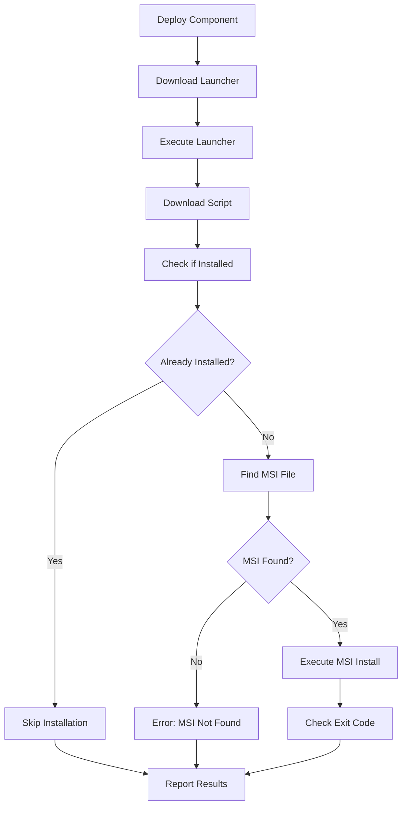

# 🖨️ Tungsten Printix Client Deployment Guide

## 📋 Overview

This guide covers deploying the Tungsten Printix Client installation script through Datto RMM using the Applications component category.

## 🎯 Quick Reference

### **MSI Requirements**
- **MSI Name**: `CLIENT_{mandevo.printix.net}_{d1a50571-67e6-4566-9da7-64e11a26a4d9} (1).MSI`
- **WRAPPED_ARGUMENTS**: `/id:d1a50571-67e6-4566-9da7-64e11a26a4d9`
- **Installation Type**: Silent MSI installation
- **Component Category**: Applications (Software Deployment)

### **File Locations**
- **Script**: `components/Applications/TungstenPrintixClient.ps1`
- **Launcher**: `launchers/hardcoded/TungstenPrintixClient-Launcher.ps1`

## 🚀 Deployment Options

### **Option 1: Hard-Coded Launcher (Recommended)**

**Datto RMM Applications Component Configuration:**

```powershell
# Tungsten Printix Client Installation Launcher
$LauncherURL = "https://raw.githubusercontent.com/aybouzaglou/Datto-RMM-Powershell-Scripts/main/launchers/hardcoded/TungstenPrintixClient-Launcher.ps1"
$LauncherPath = "$env:TEMP\TungstenPrintixClient-Launcher.ps1"

[Net.ServicePointManager]::SecurityProtocol = [Enum]::ToObject([Net.SecurityProtocolType], 3072)
(New-Object System.Net.WebClient).DownloadFile($LauncherURL, $LauncherPath)

& $LauncherPath
exit $LASTEXITCODE
```

**Component Settings:**
- **Component Name**: `Install Tungsten Printix Client`
- **Component Type**: `Applications`
- **Timeout**: `30 minutes`
- **Environment Variables**: None required (hard-coded)

### **Option 2: Universal Launcher**

**Datto RMM Applications Component Configuration:**

```powershell
# Universal Launcher for Tungsten Printix Client
$LauncherURL = "https://raw.githubusercontent.com/aybouzaglou/Datto-RMM-Powershell-Scripts/main/launchers/LaunchInstaller.ps1"
$LauncherPath = "$env:TEMP\LaunchInstaller.ps1"

[Net.ServicePointManager]::SecurityProtocol = [Enum]::ToObject([Net.SecurityProtocolType], 3072)
(New-Object System.Net.WebClient).DownloadFile($LauncherURL, $LauncherPath)

& $LauncherPath -ScriptName $env:ScriptName
exit $LASTEXITCODE
```

**Required Environment Variables:**
- **ScriptName** (String): `TungstenPrintixClient.ps1`

## 📁 MSI File Preparation

### **Datto RMM File Attachment (Recommended)**

1. **Download MSI File**
   - Obtain the MSI file: `CLIENT_{mandevo.printix.net}_{d1a50571-67e6-4566-9da7-64e11a26a4d9} (1).MSI`
   - Verify the file name matches exactly (including spaces and parentheses)

2. **Attach to Datto RMM Component**
   - In the Datto RMM component editor, use the **file attachment fields** beneath the script edit box
   - Upload the MSI file as an attachment to the component
   - The script will automatically find the attached file in the working directory

3. **How It Works**
   - Datto RMM places attached files in the same directory as the script execution
   - No need to specify full paths - the MSI file is referenced directly by name
   - This is the official Datto RMM approach for including installer files

## 🔧 Script Features

### **Installation Logic**
- ✅ **Detection**: Registry-based software detection (avoids Win32_Product)
- ✅ **Smart Installation**: Only installs if not already present
- ✅ **MSI Support**: Proper WRAPPED_ARGUMENTS handling
- ✅ **Logging**: Comprehensive logging to `C:\ProgramData\DattoRMM\Applications\`
- ✅ **Cleanup**: Pre-execution cleanup of temp files and processes

### **Exit Codes**
- **0**: Success (installation completed)
- **3010**: Success with reboot required
- **1641**: Success with reboot initiated
- **1**: General failure
- **2**: Launcher failure

### **Logging Locations**
- **Script Log**: `C:\ProgramData\DattoRMM\Applications\TungstenPrintixClient-Applications.log`
- **MSI Log**: `C:\ProgramData\DattoRMM\Applications\PrintixClient-Install.log`
- **Launcher Log**: `C:\ProgramData\DattoRMM\TungstenPrintixClient-Launcher-[timestamp].log`

## 🛠️ Troubleshooting

### **Common Issues**

**MSI File Not Found**
```
Error: MSI file not found as attachment
```
**Solution**: Ensure the MSI file is properly attached to the Datto RMM component using the file attachment feature

**Installation Failed**
```
Error: Installation failed with exit code: [code]
```
**Solution**: Check MSI installation log for detailed error information

**Permission Issues**
```
Error: Access denied during installation
```
**Solution**: Ensure Datto RMM agent is running with appropriate privileges

### **Verification Steps**

1. **Check Installation**
   - Look for Tungsten Printix Client in Add/Remove Programs
   - Verify registry entries under `HKLM\SOFTWARE\Microsoft\Windows\CurrentVersion\Uninstall`

2. **Review Logs**
   - Check script execution log for detailed progress
   - Review MSI installation log for installer-specific issues

3. **Manual Testing**
   - Test MSI installation manually with same arguments:
     ```cmd
     msiexec /i "C:\Temp\CLIENT_{mandevo.printix.net}_{d1a50571-67e6-4566-9da7-64e11a26a4d9} (1).MSI" /quiet WRAPPED_ARGUMENTS="/id:d1a50571-67e6-4566-9da7-64e11a26a4d9"
     ```

## 📊 Deployment Workflow



## 🎯 Best Practices

1. **Attach MSI Files**: Use Datto RMM file attachment feature to include MSI files with the component
2. **Test First**: Test on a small group of devices before mass deployment
3. **Monitor Logs**: Review logs for any installation issues
4. **Reboot Planning**: Be prepared for potential reboot requirements (exit codes 3010/1641)
5. **Verify Installation**: Confirm successful installation through software inventory

## 📞 Support

For issues with this deployment script:
1. Check the troubleshooting section above
2. Review the comprehensive logs generated during execution
3. Test manual MSI installation to isolate script vs. installer issues
